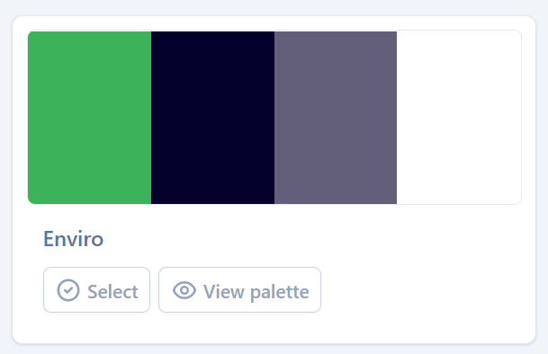

# DevHub

**User credentials**
To use the website, you may either create your own account, or use the following test user credentials:
- Username:
- Password:

## Goals For This Project

## Table of Contents

## UX/UI

### User Goals

### User Stories

### Site Owner's Goals

### User Requirements and Expectations

#### Requirements

#### Expectations

### Design Choices

#### Colours
For this project, I used the pre-made ['Enviro'](https://colorhub.vercel.app/select-palette/enviro) colour pallete from [Daniel Cranney](https://twitter.com/danielcranney)'s ['ColorHub'](https://colorhub.vercel.app/). I decided that I wanted green to be the focal brand colour of this project to symbolise growth. Also, I wanted the other colours in the pallete to be more mild shades of black, grey, and white, to make the brand green stand out.

The colours used were:
- `#3CB35A`: This colour was used as the brand colour, used mostly on call to action buttons/links, or anything else that I wanted to focus the user's attention to.
- `#03012C`: This colour was used as the primary colour for text (on a white background), and to give a contrasting background to some sections - such as the sidebar.
- `#635E79`: This colour was used sparingly either as text decoration or borders - I chose this colour as I felt it is fairly subtle/understated.
- `#FFFFFF`: This colour is used as the primary background colour, and text colour on dark backgrounds.

#### Fonts
I used a pairing of two [Google Fonts](https://fonts.google.com/) - [Montserrat](https://fonts.google.com/specimen/Montserrat?query=montserrat) for titles and [Source Sans Pro](https://fonts.google.com/specimen/Source+Sans+Pro?query=source+sans+pro) for regular text - based on the recommendation of [this article on Coral Nodes](https://www.coralnodes.com/best-google-font-combinations/).

#### Accessibility

### Wireframes

#### Desktop

#### Tablet

#### Mobile

### UX/UI Flowchart

## Features

### Existing Features

### Features to be Implemented
- Upvoting/Downvoting:
- 

## Technologies Used

### Languages
- [HTML](https://developer.mozilla.org/en-US/docs/Learn/Getting_started_with_the_web/HTML_basics)
- [CSS](https://developer.mozilla.org/en-US/docs/Web/CSS)
- [JavaScript](https://developer.mozilla.org/en-US/docs/Web/JavaScript)
- [Python](https://www.python.org/)
- [Jinja](https://jinja.palletsprojects.com/en/3.1.x/)

### Libraries + Frameworks
- [Flask](https://flask.palletsprojects.com/en/2.1.x/)
- [Bootstrap](https://getbootstrap.com/)
- [jQuery](https://jquery.com/)
- [MongoDB](https://www.mongodb.com/)

### Design
- [Figma](https://www.figma.com/)
- [Font Awesome](https://fontawesome.com/)
- [Google Fonts](https://fonts.google.com/)

## Testing

### Test Title

#### Test Description
Add in a table for the Plan, Implementation, Test, Result steps
Add screenshot for each test

## Bugs

### Bug Title

#### Bug Description
- **Bug**: 
- **Fix**:
- **Verdict**:

## Deployment

### Local Development

### Deployment

## Credits

### General Thanks